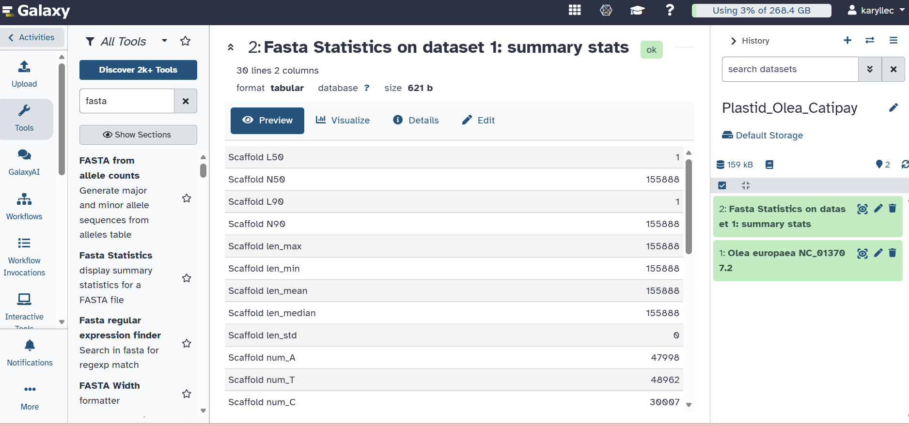

# Plastid Genome Characterization: *Olea europaea*

## 1. Student Information & Assigned Taxon
* **Student Name:** Niña Karylle A. Catipay
* **Course & Section:** Cell & Molecular Biology
* **Assigned Genus:** *Olea*
* **Selected Species:** *Olea europaea* (Common Olive)

## 2. Genome Information & Data Source
* **NCBI Accession / Version:** [`NC_013707.2`](https://www.ncbi.nlm.nih.gov/nuccore/NC_013707.2)
* **Source Link:** [NCBI Nucleotide - NC_013707.2](https://www.ncbi.nlm.nih.gov/nuccore/NC_013707.2)
* **Date Retrieved:** October 2026
* **Genome Size:** 155,888 bp
* **Short Plastome Summary:** The *Olea europaea* plastid genome is a single circular chromosome displaying the classic quadripartite architecture found in land plants. It consists of a Large Single-Copy (LSC) region (~85,528 bp), a Small Single-Copy (SSC) region (~17,856 bp), and a pair of inverted repeats (IRa/IRb) measuring ~26,252 bp each. It features an overall GC content of 37.80%.

## 3. Galaxy Analysis & Workflow
* **Methodology:** The full-length chloroplast sequence was downloaded from NCBI Nucleotide in FASTA format (`.fasta`) and uploaded directly to the [UseGalaxy.org](https://usegalaxy.org) web platform via the built-in Upload Data interface.
* **Galaxy History Name:** `Plastid_Olea_Catipay`
* **Tools Used:** 
  * `Upload Data` (for importing sequence data)
  * `Fasta Statistics` (for verifying complete sequence length and base distribution)

## 4. Galaxy Analysis Evidence
The screenshot below confirms the completed Galaxy history and summary stats output:

## 5. Summary of Gene Content & Observations
* **Total Annotated Genes:** 130
* **Protein-Coding Genes (CDS):** 85
* **tRNA Genes:** 37
* **rRNA Genes:** 8
* **Important Observations:**
  1. Ribosomal RNA genes (*rrn16*, *rrn23*, *rrn4.5*, *rrn5*) are located within the Inverted Repeat regions and are therefore duplicated in two identical copies across the genome.
  2. The *trnK-UUU* gene contains a prominent intron encoding the *matK* (maturase K) open reading frame, which is widely utilized in plant molecular phylogenetics and DNA barcoding.
  3. The GC content (37.80%) is slightly higher within the IR regions compared to single-copy regions due to GC-rich ribosomal RNA loci.

## 6. How to Reproduce This Analysis
Another student can replicate this workflow by following these steps:
1. Navigate to NCBI Nucleotide, search for accession `NC_013707.2`, click **Send to** $\rightarrow$ **File** $\rightarrow$ **FASTA**, and download the file.
2. Log into [usegalaxy.org](https://usegalaxy.org) and create a new history named `Plastid_Olea_<YourSurname>`.
3. Click **Upload Data**, select the downloaded FASTA file, and wait for the job to complete (turn green).
4. Search for the **Fasta Statistics** tool in the left panel, select your uploaded file as input, and click **Run Tool**.
5. Inspect the output table via the **Eye icon ($\mathbf{\odot}$)** to confirm sequence length (155,888 bp) and base compositions.

## 7. References & Data Sources
1. **NCBI Nucleotide Database:** https://www.ncbi.nlm.nih.gov/nuccore/NC_013707.2
2. **Galaxy Web Platform:** https://usegalaxy.org
